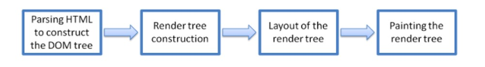
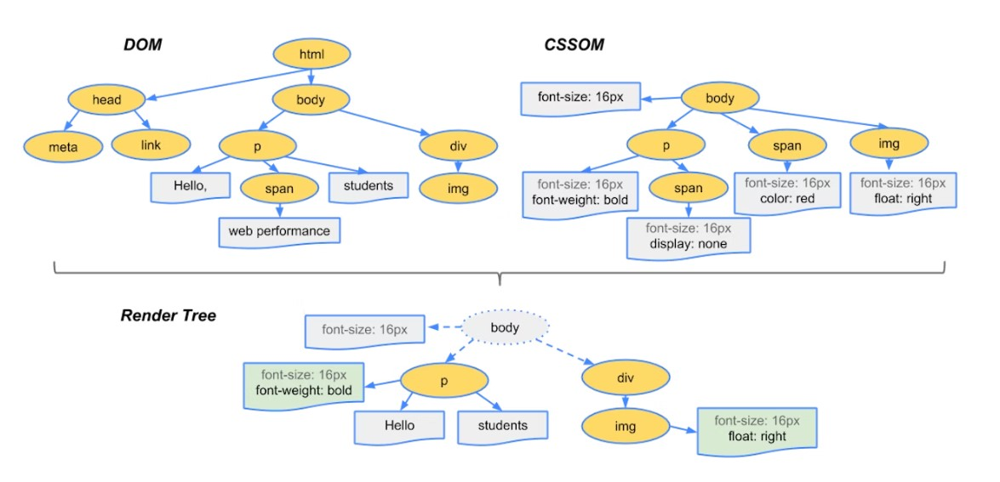

# What is a web browser?

A web browser takes you anywhere on the internet, letting you see text, images and video from anywhere in the world.

The web is a vast and powerful tool. Over the course of a few decades, the internet has changed the way we work, the way we play and the way we interact with one another. Depending on how it’s used, it bridges nations, drives commerce, nurtures relationships, drives the innovation engine of the future and is responsible for more memes than we know what to do with.

It’s important that everyone has access to the web, but it’s also vital that we all <a href="https://blog.mozilla.org/en/internet-culture/mozilla-explains/internet-search-engine-browser/?_gl=1%2Atrnpxr%2A_ga%2ANzM2NTgzMTkzLjE2NjgzNTA4NzI.%2A_ga_MQ7767QQQW%2AMTY2ODM1MDg3Mi4xLjAuMTY2ODM1MDg3Mi4wLjAuMA.." target="_blank">understand the tools</a>  we use to access it. We use web browsers like Mozilla Firefox, Google Chrome, Microsoft Edge and Apple Safari every day, but do we understand what they are and how they work? In a short period of time we’ve gone from being amazed by the ability to send an email to someone around the world, to a change in how we think of information. It’s not a question of how much you know anymore, but simply a question of what browser or app can get you to that information fastest.

# High Level Components of a browser.

A web browser takes you anywhere on the internet. It retrieves information from other parts of the web and displays it on your desktop or mobile device. The information is transferred using the Hypertext Transfer Protocol, which defines how text, images and video are transmitted on the web. This information needs to be shared and displayed in a consistent format so that people using any browser, anywhere in the world can see the information.

Sadly, not all browser makers choose to interpret the format in the same way. For users, this means that a website can look and function differently. Creating consistency between browsers, so that any user can enjoy the internet, regardless of the browser they choose, is called web standards.

When the web browser fetches data from an internet connected server, it uses a piece of software called a rendering engine to translate that data into text and images. This data is written in Hypertext Markup Language (HTML) and web browsers read this code to create what we see, hear and experience on the internet.

Hyperlinks allow users to follow a path to other pages or sites on the web. Every webpage, image and video has its own unique Uniform Resource Locator (URL), which is also known as a web address. When a browser visits a server for data, the web address tells the browser where to look for each item that is described in the html, which then tells the browser where it goes on the web page.


# Rendering Engine in Browsers

## Understanding the architecture of a web browser
A web browser is a software application that enables a user to access and display web pages or other online content through its graphical user interface. Refer to the image below to understand the key components involved in building a web browser.


### User Interface: 
This component allows end-users to interact with all visual elements available on the web page. The visual elements include the address bar, home button, next button, and all other elements that fetch and display the web page requested by the end-user.

### Browser Engine: 
It is a core component of every web browser. The browser engine functions as an intermediary or a bridge between the user interface and the rendering engine. It queries and handles the rendering engine as per the inputs received from the user interface.
### Rendering Engine: 

As the name suggests, this component is responsible for rendering a specific web page requested by the user on their screen. It interprets HTML and XML documents along with images that are styled or formatted using CSS, and a final layout is generated, which is displayed on the user interface.

### Networking: 
This component is responsible for managing network calls using standard protocols like HTTP or FTP. It also looks after security issues associated with internet communication.

### JavaScript Interpreter: 
As the name suggests, it is responsible for parsing and executing the JavaScript code embedded in a website. Once the interpreted results are generated, they are forwarded to the rendering engine for displaying on the user interface.

### UI Backend: 
This component uses the user interface methods of the underlying operating system. It is mainly used for drawing basic widgets (windows and combo boxes).

### Data Storage/Persistence: 
It is a persistent layer. A web browser needs to store various types of data locally, for example, cookies. As a result, browsers must be compatible with data storage mechanisms such as WebSQL, IndexedDB, FileSystem, etc.

## Role of Rendering Engine:
Once a user requests a particular document, the rendering engine starts fetching the content of the requested document. This is done via the networking layer. The rendering engine starts receiving the content of that specific document in chunks of 8 KBs from the networking layer. After this, the basic flow of the rendering engine begins.



The four basic steps include:

* The requested HTML page is parsed in chunks, including the external CSS files and in style elements, by the rendering engine. The HTML elements are then converted into DOM nodes to form a “content tree” or “DOM tree.”

* Simultaneously, the browser also creates a render tree. This tree includes both the styling information as well as the visual instructions that define the order in which the elements will be displayed. The render tree ensures that the content is displayed in the desired order.

* Further, the render tree goes through the layout process. When a render tree is created, the position or size values are not assigned. The entire process of calculating values for evaluating the desired position is called a layout process. In this process, every node is assigned the exact coordinates. This ensures that every node appears at an accurate position on the screen.

* The final step is to paint the screen, wherein the render tree is traversed, and the renderer’s paint() method is invoked, which paints each node on the screen using the UI backend layer.

# Parser

A parser is the module of a compiler or interpreter that parses a source code file.

More generally, it's a piece of software that parses text and transforms its content to another representation.

Parsing means analyzing and converting a program into an internal format that a runtime environment can actually run, for example the JavaScript engine inside browsers.

The browser parses `HTML` into a `DOM tree`. HTML parsing involves tokenization and tree construction. HTML tokens include start and end tags, as well as attribute names and values. If the document is well-formed, parsing it is straightforward and faster. The parser parses tokenized input into the document, building up the document tree.

When the HTML parser finds non-blocking resources, such as an image, the browser will request those resources and continue parsing. Parsing can continue when a CSS file is encountered, but `<script>` tags—particularly those without an async or defer attribute—blocks rendering, and pauses parsing of HTML.

When the browser encounters `CSS` styles, it parses the text into the `CSS Object Model` (or CSSOM), a data structure it then uses for styling layouts and painting. The browser then creates a render tree from both these structures to be able to paint the content to the screen. JavaScript is also downloaded, parsed, and then executed.

`JavaScript` parsing is done during compile time or whenever the parser is invoked, such as during a call to a method.

# Script execution precedence

The Location of JavaScript on Your Web Page
Since the JavaScript on your page executes based on certain factors, let's consider where and how to add JavaScript to a web page. 

There are basically three locations into which we can attach JavaScript:

* Directly into the head of the page
* Directly into the body of the page
* From an event handler/listener

It doesn't make any difference whether the JavaScript is within the web page itself or in external files linked to the page. It also doesn't matter whether the event handlers are hard-coded into the page or added by the JavaScript itself (except that they can't be triggered before they are added).

## Code Directly on the Page
What does it mean to say that JavaScript is directly in the head or body of the page? If the code is not enclosed in a function or object, it is directly in the page. In this case, the code runs sequentially as soon as the file containing the code has loaded sufficiently for that code to be accessed.

Code that is within a function or object is run only when that function or object is called.

Basically, this means that any code inside the head and body of your page that is not inside a function or object will run as the page is loading — as soon as the page has loaded sufficiently to access that code.

That last bit is important and impacts the order in which you place your code on the page: any code placed directly in the page that needs to interact with elements within the page must appear after the elements in the page on which it is dependent.

In general, this means that if you use direct code to interact with your page content, such code should be placed at the bottom of the body.

### Code Within Functions and Objects
A code inside functions or objects is run whenever that function or object is called. If it is called from code that is directly in the head or body of the page, then its place in the execution order is effectively the point at which the function or object is called from the direct code.

## Code Assigned to Event Handlers and Listeners

Assigning a function to an event handler or listener does not result in the function being run at the point at which it is assigned — provided that you are actually assigning the function itself and not running the function and assigning the value returned. (This is why you generally do not see the () on the end of the function name when it is being assigned to an event since the addition of the parentheses runs the function and assigns the value returned rather than assigning the function itself.)

Functions that are attached to event handlers and listeners run when the event that they are attached to is triggered. Most events are triggered by visitors interacting with your page. Some exceptions exist, however, such as the load event on the window itself, which is triggered when the page finishes loading.

## Functions Attached to Events on Page Elements
Any functions attached to events on elements within the page itself will run according to the actions of each individual visitor — this code runs only when a particular event occurs to trigger it. For this reason, it doesn't matter if the code never runs for a given visitor, since that visitor has obviously not performed the interaction that requires it.

All of this, of course, assumes that your visitor has accessed your page with a browser that has JavaScript enabled.

## Customized Visitor User Scripts
Some users have installed special scripts that may interact with your web page. These scripts run after all of your direct code, but before any code attached to the load event handler.

Since your page knows nothing about these user scripts, you have no way of knowing what these external scripts might do —  they could override any or all of the code that you have attached to the various events to which you have assigned processing. If this code overrides event handlers or listeners, the response to event triggers will run the code defined by the user instead of, or in addition to, your code.

The take home point here is that you cannot assume that code designed to run after the page has loaded will be allowed to run the way that you designed it. In addition, be aware that some browsers have options that allow disabling of some event handlers within the browser, in which case a relevant event trigger will not launch the corresponding event handler/listener in your code.

# Render-tree Construction, Layout, and Paint
The `CSSOM` and `DOM trees` are combined into a render `tree`, which is then used to compute the layout of each visible element and serves as an input to the paint process that renders the pixels to screen. Optimizing each of these steps is critical to achieving optimal rendering performance.

In the previous section on constructing the object model, we built the DOM and the `CSSOM `trees based on the HTML and CSS input. However, both of these are independent objects that capture different aspects of the document: one describes the content, and the other describes the style rules that need to be applied to the document. How do we merge the two and get the browser to render pixels on the screen?

### TL;DR #
* The DOM and CSSOM trees are combined to form the render tree.
* Render tree contains only the nodes required to render the page.
* Layout computes the exact position and size of each object.
* The last step is paint, which takes in the final render tree and renders the pixels to the screen.

First, the browser combines the `DOM` and `CSSOM` into a "`render tree`," which captures all the visible DOM content on the page and all the CSSOM style information for each node.



### To construct the render tree, the browser roughly does the following:

* Starting at the root of the DOM tree, traverse each visible node.
    * Some nodes are not visible (for example, script tags, meta tags, and so on), and are omitted since they are not reflected in the rendered output.
    * Some nodes are hidden via CSS and are also omitted from the render tree; for example, the span node---in the example above---is missing from the render tree because we have an explicit rule that sets the "display: none" property on it.
* For each visible node, find the appropriate matching CSSOM rules and apply them.
* Emit visible nodes with content and their computed styles.

``As a brief aside, note that visibility: hidden is different from display: none. The former makes the element invisible, but the element still occupies space in the layout (that is, it's rendered as an empty box), whereas the latter (display: none) removes the element entirely from the render tree such that the element is invisible and is not part of the layout.``

The final output is a render tree that contains both the content and style information of all the visible content on the screen. <strong>With the render tree in place, we can proceed to the "layout" stage. </strong>

Up to this point we've calculated which nodes should be visible and their computed styles, but we have not calculated their exact position and size within the viewport of the device---that's the "layout" stage, also known as "reflow."

To figure out the exact size and position of each object on the page, the browser begins at the root of the render tree and traverses it. Let's consider a simple, hands-on example:

```<!DOCTYPE html>
<html>
  <head>
    <meta name="viewport" content="width=device-width,initial-scale=1" />
    <title>Hello world!</title>
  </head>
  <body>
    <div style="width: 50%">
      <div style="width: 50%">Hello world!</div>
    </div>
  </body>
</html>
```
## Technical Conclusion

Hence the browser's processing steps:

#### 1. Process HTML markup and build the DOM tree.
#### 2. Process CSS markup and build the CSSOM tree.
#### 3. Combine the DOM and CSSOM into a render tree.
#### 4. Run layout on the render tree to compute geometry of each node.
#### 5. Paint the individual nodes to the screen.
